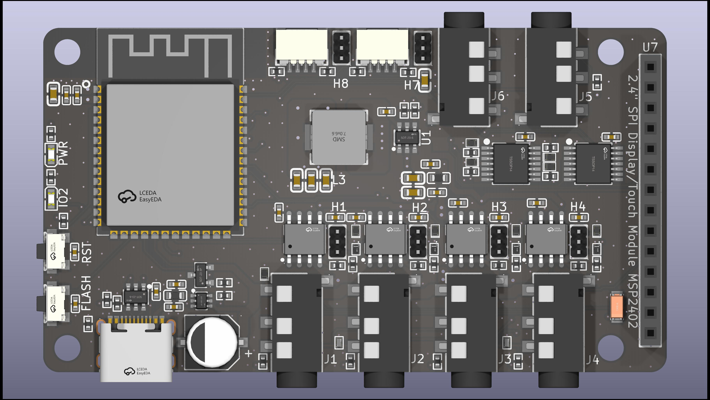
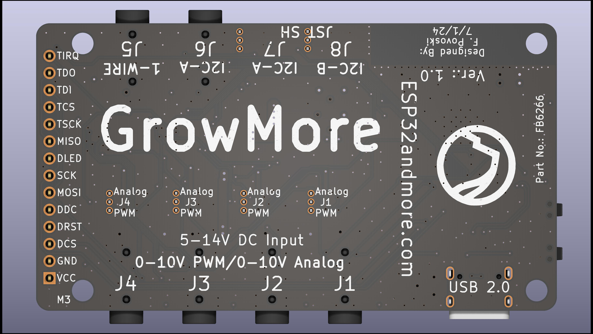
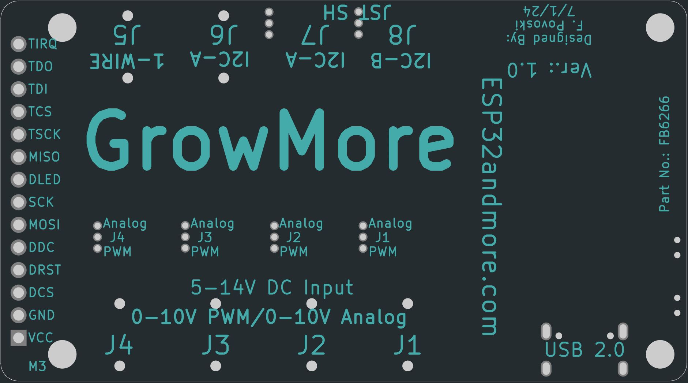

# GrowMore Hub Universal Controller
### BUY - https://www.tindie.com/products/35096/

# DO NOT PLUG IN FANS OR OTHER DEVICES INTO TRRS PORTS P1-P4 WHEN THE DEVICES ARE POWERED ON.
# TURN OFF ALL DEVICES SOURCING POWER AS IT MAY CAUSE DAMAGE TO THE GROWMORE HUB AND THE DEVICE.

## Description
The GrowMore Hub Universal Controller is the first open-source networked 0-10v controller for the "Grower", agriculture, HVAC, and lighting applications. The GrowMore Hub is an ESP32-S3 based controller for temperature and humidity monitoring and control of 0-10v Electronically Commutated (EC) in-line fans, grow lights, and other related devices. This HUB features the powerful ESP32-S3 processor from Expressif, with integrated WiFi and Bluetooth functionality (BR/EDR/BLE).

Don’t be tied to one fan or lighting manufacturer’s devices or limited controller solutions, and especially not their non-networked or APP based controllers. The GrowMore Hub is versatile, flexible, and software customizable when required in an easy programming environment

 

## Interfaces
The GrowMore Hub has four flexible individually controlled 0-10V ports, outputting either a 0-10v PWM digital signal or 0-10v analog signals, supporting a wide range of devices from numerous manufacturers that support this common standard. It has the ability to set the PWM or analog signal in 65536 steps unlike the 5 or 6 steps other controllers have. It also has the flexibility to output any maximum voltage level from 5v to 14v. It also monitors fan speed or other device outputs related to each of those device ports.

The GrowMore ports can also be used as DACs outputting 0.15 millivolt resolution at up to 20kHz.

It allows monitoring of temperature, humidity, and even pressure from multiple sensors, zone located, to allow you the flexibility for accurate control of temperature, humidity, and lighting condition for optimal plant growth.

## Open Source, Open Protocols
Whether you are using the GrowMore Hub for a small grow tent, grow room, greenhouse, or many in an entire facility, the GrowMore Hub is the perfect solution for you. Moreover, since it implements open protocols for control and monitoring, whether you are using one or one hundred, you can control and monitor your installation through one interface.

Besides each Hub having its own webserver though WiFi, accessible from any browser, it supports the ubiquitous MQTT communications protocol and integrates into popular automation software like Home Assistant, Node-Red, ThingsBoard, and many others as well as popular voice assistant interfaces like Amazon Alexa and Google Home.

## Versions
The GrowMore Hub comes in two versions, first the GrowMore Display Hub with a 2.4” LCD display and touchscreen, that allows device local monitoring and control through the touchscreen, and the second a headless GrowMore Standard Hub for remote control configurations. Moreover, you will be able to control and monitor any headless GrowMore Standard Hub, from one GrowMore Display Hub as well as the locally attached devices and sensors (currently in Beta).

## Software
The GrowMore Hub allows manual setting of fan speeds or lighting intensity setting though its LCD display, or remotely via the network with the webserver interface, HTTP API, MQTT or HA API. You can also access temperature/humidity/pressure (depending on attached sensors) reading through the same interfaces, allowing easy integration into your own control system and algorithms.

Or in the alternative set one or all of the GrowMore Hub’s ports to “Auto Mode”, in which it will use its built-in PID algorithms to maintain a target temperature or humidity and automatically turn on, turn off, or set a devices levels based on a programmed schedule. Over-temperature or under-temperature alarms are also available as well as performance monitoring and detection of failed devices.

## Cases
Both versions of the GrowMore Hub come in custom cases that can be attached to surfaces with two provided M3 screws, by its magnet base to ferrous metal surfaces, or to any surface by provided Nano tape.

## Highly Customizable
The GrowMore Hub utilizes the ESPhome system software which provides an open-source environment and that allows sophisticated customers complete control over the operation of the device and integration into environments we may not currently support. The graphical user interface is programmed in LVGL for easy modifications.

For this, the GrowMore Hub has a USB-C interface for downloading firmware and power during development. Or if you are doing small modifications or updates to firmware, use its remote Over-the-Air update feature.

## Supported Devices
The GrowMore Hub uses four (4) 3.5mm TRRS connectors to attach devices under control (at least one of the devices must provide power like a TerraBloom EC in-line fan). It supports any fan, lighting, or other device that uses the 0-10v control standard either PWM or analog controlled, such as the TerraBloom ECMF Series and the AC Infinity UIC Platform Series devices such as the Cloudline fan series, humidifiers, heaters, and grow lights (UIC adaptor cable require).

For environmental sensor inputs the GrowMore Hub has both a One-Wire port and three I2C ports which interface to a variety of One-Wire and I2C sensors.

The One-Wire port allows for a virtually unlimited (limit by total cable length) number of temperature sensors. We provide those sensors here that are factory calibrated with your controller. We also can provide sensor multiplier cables and sensor extension cables to facilitate their remote placement. Currently supported temperature sensors are the Dallas DS18B20.

The I2C ports support up to two SHT20 Temperature and Humidity Sensors via a TRRS cable or the JST-SH interfaces.  More sensors will be available.

## Specifications:
* Size: Board - 73mm x 42mm with 3mm mounting holes. Case: 84mmx47mm

* Processor: ESP32-S3 with 8MB flash and 2MB PSRAM with WiFi and BT V4.2

* Power Input: Nominal 10v (5v-14v range) @ 330ma max via a 3.5mm TRRS connector or 5v via USB-C connector.

* On Board Switching Regulation: 3.3v @ 2.0 amps max.

* Power Consumption: Typical average 0.7w or 70ma @ 10v.

* I/O: Fourteen pin 2.5mm header for display board

* I/O: Four 0-10v digital PWM or 0-10v analog output, four open-source inputs via (4) 3.5mm TRRS connectors.

* I/O: One One-Wire interface with power and ground via 3.5mm TRRS connector.

* I/O: Two I2C interface buses, one via JST-SH and 3.5mm TRRS connectors and second via JST-SH connector.

* I/O: USB 2.0 via USB-C connector

* Display: TFT LCD module with resolution of 320x240, 16-bit depth with touch screen.

## Setup and Configuration

* The Flash and Reset Buttons are recessed on the USB end of the GrowMore Hub. The inner button is the Reset Button and the Flash Button is to the outside. Use a large paper clip or similar diameter instrument to depress then if required.

* Power is supplied by a connected EC inline fan, connected to ports P1-P4. It is HIGHLY SUGGESTED YOU ALWAYS POWER ALL YOUR FAN OFF WHEN CONNECTING DEVICES TO THE GROWMORE HUB.  Although the HUB has protections in place, the is the wise thing to do otherwise damage to the HUB many occur.

* To place on WiFi network use 2.4G phone to connect to "GrowMore Fallback Hotspot" with password "esphome1".. Once connected to your WiFi network, to access the webpage of
the device browse to http://growmore.local

* Device is flashed with an exmaple ESPhome binary image that has manual control over fans 
and automatic control which can be enabled based the target temperature setting.  Four temperature
sensors control each of the four PWM fan connectors.
Flashed binary image  has the Home Assistant "api:" enabled with MQTT with.

* For customization, please make a request to esp32andmore@gmail.com for source code.

* Also update WiFi and MQTT server credentials as required.

* Flash over USB or ethernet. To flash over USB use ESPhome Web Flasher https://web.esphome.io/
with the device powered and connected to your host machine.

* If you did not purchase the Dallas DS18B20 temeprature sensors from us, due to a recent change in ESPHome, the DS18B20 sensor address will need to be discover and a code compilation with the device being flashed.

## Four Fan Control Ports (TRRS Connector) P1-P4 (Board Label J1-J4)
The HUB supports the 0-10V lighting control standard to control numerous types of device from EC Inline Fans to HVAC equipement, either by a digital 0-10V  PWM signal or an analog 0-10V signal.  For Terrabloom fans, please use the fan manufacturer's provided TRRS cable and firmly seat the cable to ports P1-P4 on the HUB with the ALL PLUGGED FANS DISCONNECTED FROM POWER. For AC Infinity fans, please use the fan manufacturer's provided UIC cable with the GrowMore Hub UIC Adaptor Cable available on Tindie. For other devices that comform to that standard please contact regarding its phsyical connection.

Selection of digital PWM 0-10v or analog 0-10v output can be made by onboard jumpers for each individual port labeled J1-J4. Place the jumper from the center pin to the pin labeled "PWM" for digital or place the jumper from the center pin to the pin labeled "Analog" for analog output. The factory default is set to "PWM".

## Dallas One-wire Port DS (Board Label J5)
You can connect one DS18B20 sensors to the DS port or up to four DS18B20 sensors to the DS port using the GrowMore Hub Sensor Multiplier Cable available on Tindie. You can also extend the cabling distance of the sensor or sensors up to a agregate distance of 16 meters or 52 feet using the GrowMore Hub Sensor Extension Cable available on Tindie.  Again ensure that ALL PLUGGED FANS ARE DISCONNECTED FROM POWER. These ports can be configured from the factory set digital 0-10v PWM signal to a 0-10v analog signal by an internal jumper.

## USB-C Connector (Board Label J9)
USB 2.0, 5V, 2amps for power without fans connected and flashing of firmware.

## I2C TRRS Port S1 (Board Label J6)
This port is used to connect I2C sensors such as the SHT40 Temperature and Humidity Sensor avalable from us on Tindie, or your own.  The port supplies 3.3v power and uses 3.3v signaling. DO NOT CONNECT 5V SENSORS. You can again use the GrowMore Hub Sensor Multiplier Cable available on Tindie to add mutilple sensors as long as I2C addressing does not conflict. You can also extend the cabling distance of sensors up to a agregate distance of 8 meters or 26 feet using the GrowMore Hub Sensor Extension Cable available on Tindie.

It shares the same I2C bus as the JST-SH port also labeled S1. Currently the HUB's firmware supports the SHT40 Sensor but an easy modification of the firware will allow other sensors.  Please make that request to use and we will provide you with support to do so.

## I2C JST-SH Port S1 (Board Label J7)
This port is the shared I2C port on the TRRS connector above. Please make sure sensor I2C addresses do not conflict. Again all the above applies here.

## I2C JST-SH Port S2 (Board Label J8)
This port is a distinct I2C bus from the above S1 ports.  YOU MAY add sensors here with the same I2C address such as a second SHT40 sensor.  If you would like to add your own sensors, please make that request to use and we will provide you with support to do so.

## Sensors and Expansion Accessories for the GrowMore Hub
* GrowMore Hub DS18B20 Temperature Sensor (https://www.tindie.com/products/35127/).

* GrowMore Hub SHT40 Temperature and Humidity Sensor (https://www.tindie.com/products/35101/).

* GrowMore Hub BME280 Temperature, Humidity, and Pressure Sensor. (TBA)

* GrwoMore Hub AS7341 Spectral Light Sensor. (TBA)

* GrowMore Hub SCD41 CO2 Sensor. (TBA)

* GrowMore Hub THC-S Soil TDR Sensor. (TBA)

* GrowMore Hub UIC Adaptor Cable (https://www.tindie.com/products/35125/).

* GrowMore Hub Sensor Multiplier Cable (https://www.tindie.com/products/35124/).

* GrowMore Hub Sensor Extension Cable (https://www.tindie.com/products/35128/).
